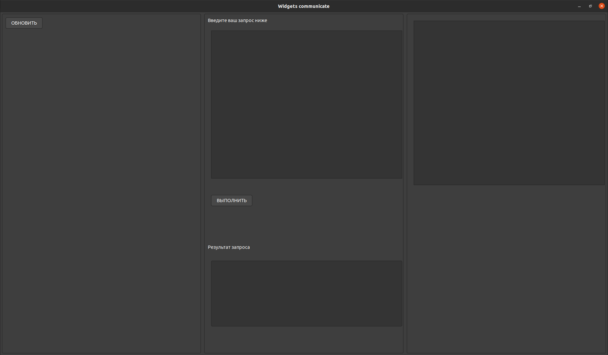
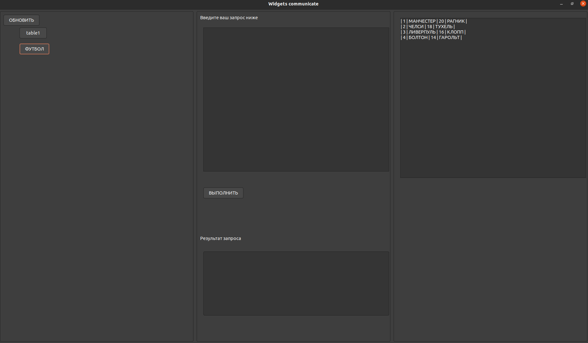
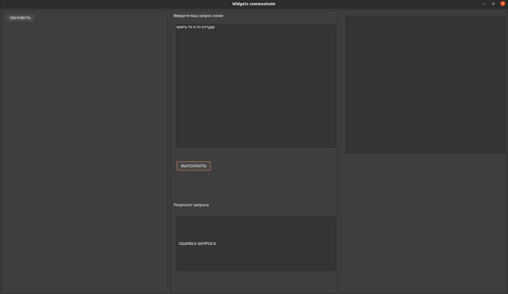
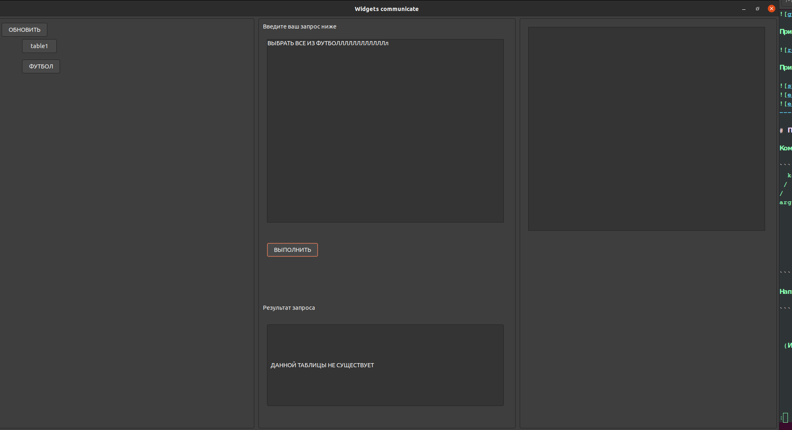

# PIDB

PIDB - база данных, предназначенная для работы с данными.
PIDB имеет следующий графический интерфейс:


При нажатии на кнопку "ОБНОВИТЬ" выведутся доступные таблицы:



При выполнении успешной компиляции запроса, будет выведена таблица результатов или же ошибка компиляции:




--------------------

# Принципы работы компилятора

Компилятор передает запрос парсеру, где строится дерево, соответствующее запросу. Пправильный запрос должен иметь следующую структуру:

```
  keyword
 /      \
/        \
args     keyword
         /   \
        /     \
    args       keyword
                / \
               /   \
              /     \
           args      ...
```

Например, для `ВЫБРАТЬ ИМЯ, ЦВЕТ ИЗ ЛЮДИ ГДЕ ЦВЕТ = КРАСНЫЙ СОРТИРУЯ ИМЯ` запроса дерево будет следуюим:

```
         ВЫБРАТЬ
         /    \
        /      \
 {ИМЯ,ЦВЕТ}     ИЗ    
                /\ 
               /  \
           {ЛЮДИ}   ГДЕ
                    / \
                   /   \
   {ЦВЕТ = КРАСНЫЙ }  СОРТИРУЯ
                      /
                     /
                    {ИМЯ}
```


При успешном парсинге формируется план запроса,используя ассоциативный словарь, где ключ - ключевое слово, а значение ключа - аргументы,
и передается на исполнение `ExecuteMachine `. Данные записываются на вторичное устройство.

Файловая структура выглядит следующим образом:


```
---Db
    |
   data--|
    |    |
    |    Schemes----[Scheme1, Scheme2]
    |    |
    |    |
    |    Tables--Table1---[Row1, Row2,...]
    |        |
    |        |
    |        |
    |        |-----Table2---[Row1, Row2,...]
    |
    |
    |
    |
    meta--|
    |     |
    |     Schemes----[Schema1_meta_data, Schema2_meta_data,...]
    |     |
    |     |
    |     Tables-----[Table1_meta_data, Table2_meta_data,...]
    |

```

Директория `data` содержит данные отношений и схем.
Директория `meta` будет содержать метаинформацию о схемах и отношениях.

