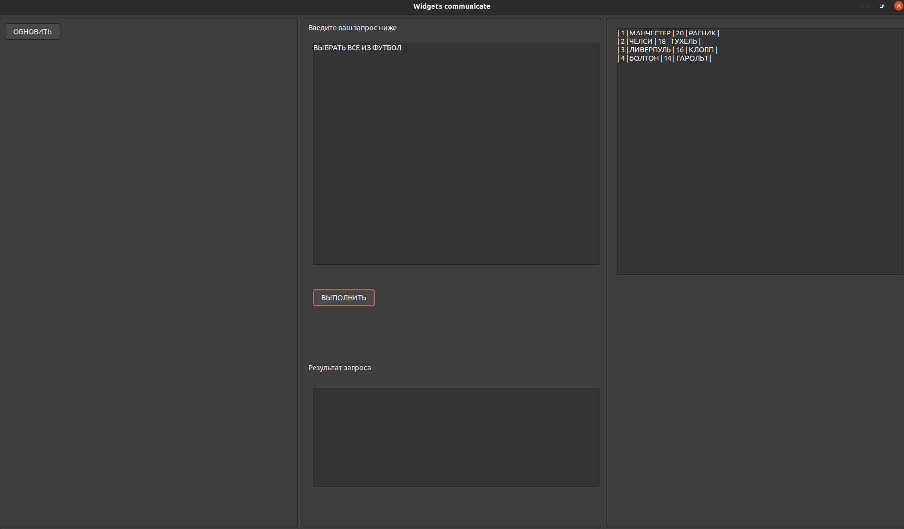

# PIDB

PIDB - база данных, предназначенная для работы с данными.
PIDB имеет следующий графический интерфейс:


При нажатии на кнопку "ОБНОВИТЬ" выведутся доступные таблицы:


При выполнении успешной компиляции запроса, будет выведена таблица результатов или же ошибка компиляции:




--------------------

# Принципы работы компилятора

Компилятор передает запрос парсеру, где строится дерево, соответствующее запросу. Пправильный запрос должен иметь следующую структуру:

```
  keyword
 /      \
/        \
args     keyword
         /   \
        /     \
    args       keyword
                / \
               /   \
              /     \
           args      ...
```

Например, для `ВЫБРАТЬ ИМЯ, ЦВЕТ ИЗ ЛЮДИ ГДЕ ЦВЕТ = КРАСНЫЙ СОРТИРУЯ ИМЯ` запроса дерево будет следуюим:

```
         ВЫБРАТЬ
         /    \
        /      \
 {ИМЯ,ЦВЕТ}     ИЗ    
                /\ 
               /  \
           {ЛЮДИ}   ГДЕ
                    / \
                   /   \
   {ЦВЕТ = КРАСНЫЙ }  СОРТИРУЯ
                      /
                     /
                    {ИМЯ}```
